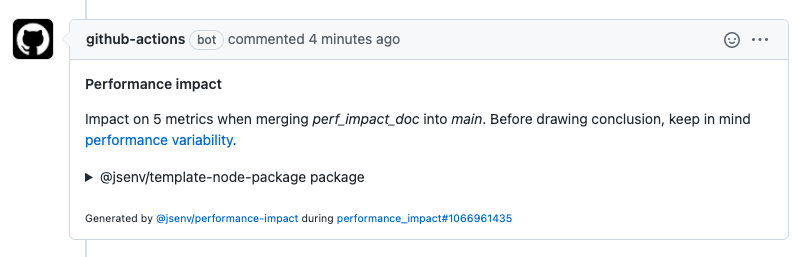
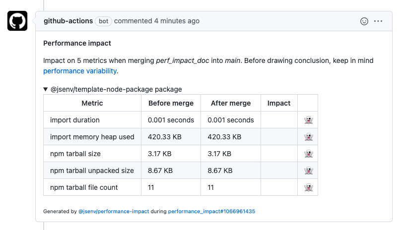

# Pull request impacts

There is a GitHub workflow runned against every pull request to report their impact on performance metrics. The report is posted in a comment of the pull request. Every time the pull request changes, workflow reruns and the comment is updated.

_Screenshot of a performance impact comment:_


_Screenshot of a performance impact comment with details opened:_


If you want to keep performance impact, check [how to use performance impact](#how-to-use-performance-impact). Otherwise see [how to remove performance impact](#How-to-remove-performance-impact).

# How to use performance impact?

The performance impact uses a group of metrics exported by [generatePerformanceReport](../../.github/workflows/performance_impact/generate_performance_report.js) function. This function is currently measuring 5 metrics.

You can also run a command to get an idea of your current performance metric values.

```console
> npm run log-performance-report
```

```json
{
  "groups": {
    "@jsenv/template-node-package package": {
      "import duration": {
        "value": 2,
        "unit": "ms"
      },
      "import memory heap used": {
        "value": 182928,
        "unit": "byte"
      },
      "npm tarball size": {
        "value": 3321,
        "unit": "byte"
      },
      "npm tarball unpacked size": {
        "value": 8985,
        "unit": "byte"
      },
      "npm tarball file count": {
        "value": 11
      }
    }
  }
}
```

# How to remove performance impact?

1. Remove `"log-performance-report"` from `"scripts"` in [package.json](../../package.json#L46)
2. Delete [.github/workflows/performance_impact.yml](../../.github/workflows/performance_impact.yml)
3. Delete [.github/workflows/performance_impact](../../.github/workflows/performance_impact) directory
4. Remove `"@jsenv/performance-impact"`from `"devDependencies"` in [package.json](../../package.json#L62)
